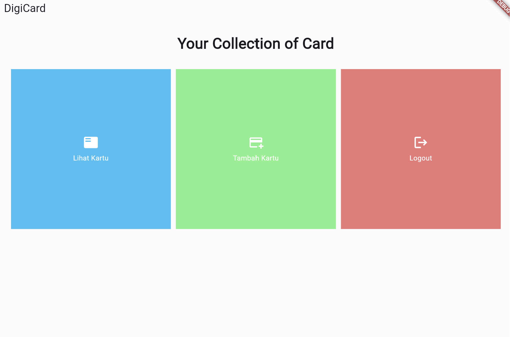
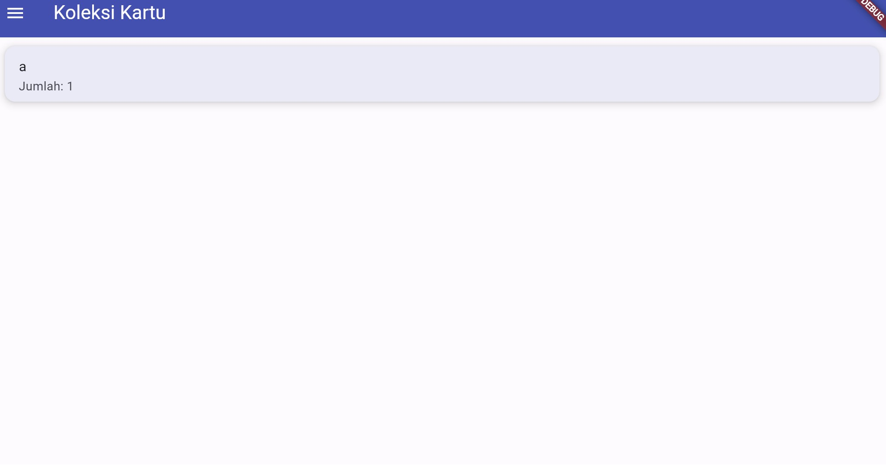
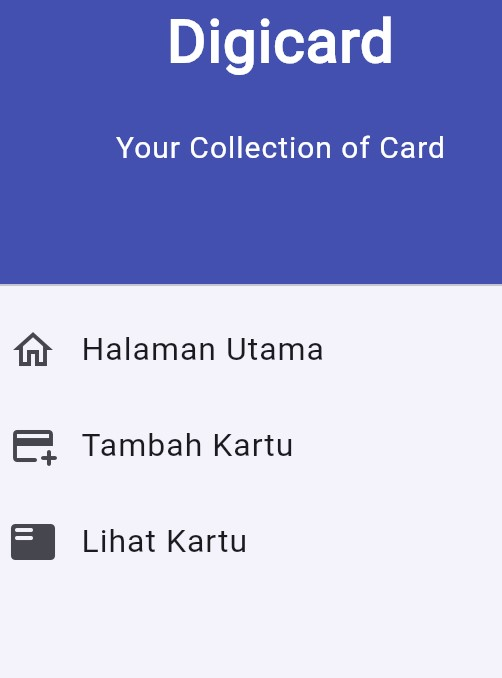

# Digicard
Virtual Card Collection
#

# Tugas 7
## statless vs stateful widget dalam flutter
<table>
  <tr>
    <th>statless</th>
    <th>statful</th>
  </tr>
  <tr>
    <td>widget yang tidak memiliki data yang berubah </td>
    <td>widget yang memiliki data yang dapat berubah</td>
  </tr>
  <tr>
    <td>untuk menggambar bagian tampilan UI yang tidak berubah sepanjang masa aplikasi, seperti teks, ikon, gambar, tombol</td>
    <td>ketika perlu mengelola keadaan yang berubah dalam aplikasi, seperti mengubah tampilan berdasarkan input pengguna, atau memperbarui data dari sumber eksternal</td>
  </tr>
  <tr>
  <td>tidak memiliki metode 'setState'</td>
  <td>memiliki metode 'setState'</td>
  </tr>
</table>

## widget yang digunakan
1. `MyHomePage`: kelas yang mewakili halaman utama atau beranda dari aplikasi.
2. `Scaffold`: widget yang memberikan kerangka untuk halaman, termasuk AppBar dan body.
3. `AppBar`: widget di bagian atas halaman yang menampilkan judul aplikasi.
4. `SingleChildScrollView`: widget yang memungkinkan scroll halaman jika sudah melebihi ukuran layar.
5. `Padding`: menambahkan jarak antara konten dengan border.
6. `Column`: widget untuk menampilkan children secara vertikal.
7. `Material`: widget yang memberikan latar belakang warna pada kartu.
8. `InkWell`: widget yang membuat area responsif terhadap sentuhan pengguna.
9. `Container`: widget yang digunakan untuk mengelompokkan ikon dan teks.
10. `Icon`: widget yang menampilkan ikon.
11. `Text`: widget yang menampilkan teks.
12. `MyApp`: kelas yang mewakili aplikasi Flutter dan mewarisi StatelessWidget, yang berarti tidak memiliki keadaan internal yang berubah.
13. `MaterialApp`: widget yang mendefinisikan kerangka dasar untuk aplikasi Flutter.
14. `title`: judul aplikasi yang akan ditampilkan di AppBar atau dalam daftar aplikasi.
15. `ThemeData`: tema aplikasi yang digunakan untuk mengkustomisasi tampilan aplikasi.
16. `ColorScheme`: bagian dari tema dan digunakan untuk mengatur skema warna aplikasi, termasuk warna latar belakang dan teks.

## Pengimplementasian Checklist
### A. Membuat sebuah program Flutter baru dengan tema inventory
1. Install flutter dan requirementnya
2. Buka folder yang akan dijadikan tempat menyimpan aplikasi dan buka command prompt
3. Jalankan kode berikut untuk membuat proyek flutter

```
flutter create digicard
```
4. Untuk menjalankan proyek, jalankan

```
cd digicard
flutter run
```
### B. Membuat tiga tombol sederhana dengan ikon dan teks
1. Merapikan proyek terlebih dahulu
    * Buat file baru bernama `menu.dart` pada folder `digicard/lib` dan tambahkan baris berikut

    ```
    import 'package:flutter/material.dart';
    ```
    * Dari file `main.dart`, cut-paste kode baris ke-39 hingga akhir yang berisi kedua class di bawah ini ke `menu.dart`

    ```
    class MyHomePage ... {
    ...
    }

    class _MyHomePageState ... {
        ...
    }
    ```
    * Tambahkan kode berikut agar class `MyHomePage` dapat dikenali oleh kode dalam file `main.dart`
    
    ```
    import 'package:manageit_mobile/menu.dart';
    ```

2. Membuat widget sederhana
    * Pada `main.dart`, title: 'Flutter Demo Home Page' yang di dalam MyHomePage, sehingga menjadi

    ```
    MyHomePage()
    ```
    * Ubah sifat widget dari stateful menjadi stateless
    
    ```
    class MyHomePage extends StatelessWidget {
    MyHomePage({Key? key}) : super(key: key);

        @override
        Widget build(BuildContext context) {
            return Scaffold(
                ...
            );
        }
    }
    ```
    * Hapus state yang ada di bawah statless widget

3. Buat class baru untuk *define* tipe yang akan berada di list

```
class CardCollection {
  final String name;
  final IconData icon;
  final Color color;

  CardCollection(this.name, this.icon, this.color);
}
```

4. Pada class `MyHomePage` tambahkan list barang

```
final List<CardCollection> items = [
    CardCollection("Lihat Kartu", Icons featured_play_list_rounded, const Color.fromARGB(255, 54, 193, 244)),
    CardCollection("Tambah Kartu", Icons.add_card_rounded, Color.fromARGB(255, 130, 240, 141)),
    CardCollection("Logout", Icons.logout, Color.fromARGB(255, 236, 120, 120)),
  ];
```

5. Tambahkan kode berikut di dalam widget build

```
return Scaffold(
      appBar: AppBar(
        title: const Text(
          'DigiCard',
        ),
      ),
      body: SingleChildScrollView(
        // Widget wrapper yang dapat discroll
        child: Padding(
          padding: const EdgeInsets.all(10.0), // Set padding dari halaman
          child: Column(
            // Widget untuk menampilkan children secara vertikal
            children: <Widget>[
              const Padding(
                padding: EdgeInsets.only(top: 10.0, bottom: 10.0),
                // Widget Text untuk menampilkan tulisan dengan alignment center dan style yang sesuai
                child: Text(
                  'Your Collection of Card', // Text yang menandakan toko
                  textAlign: TextAlign.center,
                  style: TextStyle(
                    fontSize: 30,
                    fontWeight: FontWeight.bold,
                  ),
                ),
              ),
              // Grid layout
              GridView.count(
                // Container pada card kita.
                primary: true,
                padding: const EdgeInsets.all(20),
                crossAxisSpacing: 10,
                mainAxisSpacing: 10,
                crossAxisCount: 3,
                shrinkWrap: true,
                children: items.map((CardCollection item) {
                  // Iterasi untuk setiap item
                  return CardContainer(item);
                }).toList(),
              ),
            ],
          ),
        ),
      ),
    );
```

6. Buat widget statless baru untuk menampilkan card

```
class CardContainer extends StatelessWidget {
  final CardCollection item;

  const CardContainer(this.item, {super.key}); // Constructor

  @override
  Widget build(BuildContext context) {
    return Material(
      color: item.color,
      child: InkWell(
        // Area responsive terhadap sentuhan
        onTap: () {
          // Memunculkan SnackBar ketika diklik
          ScaffoldMessenger.of(context)
            ..hideCurrentSnackBar()
            ..showSnackBar(SnackBar(
                content: Text("Kamu telah menekan tombol ${item.name}!")));
        },
        child: Container(
          // Container untuk menyimpan Icon dan Text
          padding: const EdgeInsets.all(8),
          child: Center(
            child: Column(
              mainAxisAlignment: MainAxisAlignment.center,
              children: [
                Icon(
                  item.icon,
                  color: Colors.white,
                  size: 30.0,
                ),
                const Padding(padding: EdgeInsets.all(3)),
                Text(
                  item.name,
                  textAlign: TextAlign.center,
                  style: const TextStyle(color: Colors.white),
                ),
              ],
            ),
          ),
        ),
      ),
    );
  }
}
```

### C. Memunculkan Snackbar dengan tulisan
1. Untuk memunculkan Snackbar ketika tombol ditekan, tambahkan kode berikut pada bagian child di Widget build

```
...
child: InkWell(
        // Area responsive terhadap sentuhan
        onTap: () {
          // Memunculkan SnackBar ketika diklik
          ScaffoldMessenger.of(context)
            ..hideCurrentSnackBar()
            ..showSnackBar(SnackBar(
                content: Text("Kamu telah menekan tombol ${item.name}!")));
        },
        child: Container(...
...
```

## Bonus


# Tugas 8

## `Navigator.push()` vs `Navigator.pushReplacement()`
<table>
  <tr>
    <th>Navigator.push()</th>
    <th>Navigator.pushReplacement()</th>
  </tr>
  <tr>
    <td>menambahkan halaman baru tanpa menghapus halaman sebelumnya</td>
    <td>menambahkan halaman baru dan menghapus halaman sebelumnya</td>
  </tr>
    <td>pengguna dapat kembali ke halaman sebelumnya</td>
    <td>pengguna tidak dapat kembali ke halaman sebelumnya</td>
  </tr>
</table>

## Jelaskan masing-masing layout widget
<table>
  <tr>
  <th>widget</th>
    <th>kegunaan</th>
  </tr>
    <td>Container</td>
    <td> widget serbaguna yang dapat digunakan untuk mengatur ukuran, dekorasi, padding, dan margin elemen-elemen di dalamnya</td>
  </tr>
  <tr>
    <td>Row dan Column</td>
    <td>digunakan untuk mengatur elemen-elemen secara horizontal (Row) atau vertikal (Column)</td>
  </tr>
    <td>ListView</td>
    <td>digunakan untuk menampilkan daftar elemen yang dapat digulir</td>
  </tr>
  </tr>
    <td>Expanded</td>
    <td>digunakan untuk memberikan widget anaknya ruang yang tersisa di dalam widget induknya</td>
  </tr>
  </tr>
    <td>Stack</td>
    <td>digunakan untuk menumpuk widget di atas satu sama lain</td>
  </tr>
  </tr>
    <td>GridView</td>
    <td>digunakan untuk menampilkan data dalam bentuk grid</td>
  </tr>
</table>

## Elemen input pada form
Elemen yang saya gunakan adalah `TextFormField` karena form yang digunakan berbentuk kualitatif yang berarti user mengetik sendiri. Elemen tersebut cocok untuk form yang akan dibuat.

## Penerapan clean architecture
Penerapan *Clean Architecture* melibatkan pembagian kode ke dalam tiga lapisan utama:

1. **Presentation Layer**: 
Bertanggung jawab untuk menampilkan data dan menerima input dari pengguna

2. **Domain Layer**:
Berisi aturan bisnis inti dan logika aplikasi

3. **Data Layer**:
Bertanggung jawab untuk mendapatkan dan menyimpan data

## Pengimplementasian Checklist
### A. Membuat minimal satu halaman baru pada aplikasi, yaitu halaman formulir tambah item baru
1. Buka direktori `lib` dan buat file baru bernama `cardlist_form.dart` dan isi dengan kode
```
import 'package:flutter/material.dart';

class ShopFormPage extends StatefulWidget {
    const ShopFormPage({super.key});

    @override
    State<ShopFormPage> createState() => _ShopFormPageState();
}

class _ShopFormPageState extends State<ShopFormPage> {
    @override
    Widget build(BuildContext context) {
        return Scaffold(
        appBar: AppBar(
          title: const Center(
            child: Text(
              'Form Tambah Produk',
            ),
          ),
          backgroundColor: Colors.indigo,
          foregroundColor: Colors.white,
        ),
        // TODO: Tambahkan drawer yang sudah dibuat di sini
        body: Form(
          child: SingleChildScrollView(),
        ),
      );
    }
}
```

2. Buat variabel baru sebagai handler dari form state, validasi form, dan penyimpanan form
```
class _ShopFormPageState extends State<ShopFormPage> {
    final _formKey = GlobalKey<FormState>();
    String _name = "";
    int _amount = 0;
    String _description = "";
}
```
```
body: Form(
    key: _formKey,
    child: SingleChildScrollView(
      child: Column()
    ),
),
```

3. Buatlah widget TextFormField yang dibungkus oleh Padding sebagai salah satu children dari widget Column
```
  child:
    Column(crossAxisAlignment: CrossAxisAlignment.start, children: [
      Padding(
        padding: const EdgeInsets.all(8.0),
        child: TextFormField(
          decoration: InputDecoration(
            hintText: "Nama Produk",
            labelText: "Nama Produk",
            border: OutlineInputBorder(
              borderRadius: BorderRadius.circular(5.0),
            ),
          ),
          onChanged: (String? value) {
            setState(() {
              _name = value!;
            });
          },
          validator: (String? value) {
            if (value == null || value.isEmpty) {
              return "Nama tidak boleh kosong!";
            }
            return null;
          },
        ),
      ),
    ],
  ),
```
Tambahkan kode (muali dari widget `Padding`) tersebut sebanyak variabel fieldnya

4. Buat tombol sebagai child `Column` dan dibungkus dengan widget `Padding` dan `Allign`
```
Align(
  alignment: Alignment.bottomCenter,
  child: Padding(
    padding: const EdgeInsets.all(8.0),
    child: ElevatedButton(
      style: ButtonStyle(
        backgroundColor:
            MaterialStateProperty.all(Colors.indigo),
      ),
      onPressed: () {
        if (_formKey.currentState!.validate()) {}
      },
      child: const Text(
        "Save",
        style: TextStyle(color: Colors.white),
      ),
    ),
  ),
),
```

### B. Mengarahkan pengguna ke halaman form tambah item baru ketika menekan tombol `Tambah Item `
1. Pada `menu.dart` tambahkan import
```
import 'package:digicard/screens/cardlist_form.dart';
```

2. Tambahkan kode berikut di bawah kode `ScaffoldMessenger`
```
onTap: () {
  ScaffoldMessenger.of(context)
    ..hideCurrentSnackBar()
    ..showSnackBar(SnackBar(
        content: Text("Kamu telah menekan tombol ${item.name}!")));

  if (item.name == "Tambah Kartu") {
    Navigator.push(context,
        MaterialPageRoute(builder: (context) => const ShopFormPage()));
  }
},
```

### C. Memunculkan data sesuai isi dari formulir yang diisi dalam sebuah *pop-up*
1. Tambahkan fungsi `showDialog()` pada bagian `onPressed()` dan munculkan widget `AlertDialog` pada fungsi tersebut. Kemudian, tambahkan juga fungsi untuk *reset* form.
```
child: ElevatedButton(
          style: ButtonStyle(
            backgroundColor:
                MaterialStateProperty.all(Colors.indigo),
          ),
          onPressed: () {
            if (_formKey.currentState!.validate()) {
              showDialog(
                context: context,
                builder: (context) {
                  return AlertDialog(
                    title: const Text('Parfum berhasil tersimpan'),
                    content: SingleChildScrollView(
                      child: Column(
                        crossAxisAlignment:
                            CrossAxisAlignment.start,
                        children: [
                          Text('Nama: $_name'),
                          Text('Jumlah: $_amount'),
                          Text('Deskripsi: $_description'),
                        ],
                      ),
                    ),
                    actions: [
                      TextButton(
                        child: const Text('OK'),
                        onPressed: () {
                          Navigator.pop(context);
                        },
                      ),
                    ],
                  );
                },
              );
            _formKey.currentState!.reset();
            }
          },
          child: const Text(
            "Save",
            style: TextStyle(color: Colors.white),
          ),
        ),
```

### D. Membuat sebuah drawer
1. Buat file baru bernama `left_drawer.dart` pada folder `widgets` dan masukan kode berikut
```
import 'package:digicard/screens/cardlist_form.dart';
import 'package:flutter/material.dart';
import 'package:digicard/screens/menu.dart';

class LeftDrawer extends StatelessWidget {
  const LeftDrawer({super.key});

  @override
  Widget build(BuildContext context) {
    return Drawer(
      child: ListView(
        children: [
          const DrawerHeader(
            // TODO: Bagian drawer header
          ),
          // TODO: Bagian routing
        ],
      ),
    );
  }
}
```

2. Tambahkan kode berikut pada `TODO: Bagian routing`
```
ListTile(
  leading: const Icon(Icons.home_outlined),
  title: const Text('Halaman Utama'),
  // Bagian redirection ke MyHomePage
  onTap: () {
    Navigator.pushReplacement(
        context,
        MaterialPageRoute(
          builder: (context) => MyHomePage(),
        ));
  },
),
ListTile(
  leading: const Icon(Icons.add_card_rounded),
  title: const Text('Tambah Kartu'),
  // Bagian redirection ke ShopFormPage
  onTap: () {
    Navigator.pushReplacement(
        context,
        MaterialPageRoute(
          builder: (context) => ShopFormPage(),
        ));
  },
),
```

3. Tambahkan kode berikut pada `TODO: Bagian drawer header`
```
const DrawerHeader(
  decoration: BoxDecoration(
    color: Colors.indigo,
  ),
  child: Column(
    children: [
      Text(
        'Shopping List',
        textAlign: TextAlign.center,
        style: TextStyle(
          fontSize: 30,
          fontWeight: FontWeight.bold,
          color: Colors.white,
        ),
      ),
      Padding(padding: EdgeInsets.all(10)),
      Text(
        "Catat seluruh keperluan belanjamu di sini!",
        textAlign: TextAlign.center,
        style: TextStyle(
          fontSize: 15,
          fontWeight: FontWeight.normal,
          color: Colors.white,
        ),
      ),
    ],
  ),
),
```

4. Pada `menu.dart` tambahkan drawernya
```
import 'package:digicard/widgets/left_drawer.dart';
...
return Scaffold(
  appBar: AppBar(
    title: const Text(
      'DigiCard',
    ),
    backgroundColor: Colors.indigo,
    foregroundColor: Colors.white,
  ),
  drawer: const LeftDrawer(),
)
```

## Bonus



# Tugas 9

## Apakah bisa melakukan pengambilan data JSON tanpa model
Iya bisa, tetapi lebih baik menggunakan model karena model dapat membantu dalam pembacaan dan pemrosesan data yang lebih terstruktur

## CookieRequest
Untuk memastikan penanganan cookie yang tepat selama permintaan HTTP ke server jarak jauh, diperlukan penyimpanan dan pengiriman cookie yang diberikan oleh server. Penting untuk menjaga semua cookie agar dapat mempertahankan fungsionalitasnya.

## Proses pengambilan data JSON
1. Membuat data Json
2. Membuat model dart
3. Parsing data JSON
4. Menampilkan data di flutter
5. Integrasikan dengan aplikasi flutter utama

## Mekanisme autentikasi flutter - django
1. Membuat formulir login di flutter yang akan meminta *username* dan *password*
2. Mengirim data ke Django dengan metode `HTTP POST` ke *endpoint* login di Django
3. Membuat *endpoint* untuk menangani permintaan login
4. Django akan menghasilkan token JWT yang akan dikirim lagi ke flutter
5. Menyimpan token JWT (biasanya menggunakan `Provider`)

## Widget yang dipakai
1. `Provider`: bertanggung jawab untuk mengelola dan menyediakan data, seperti pada situasi penggunaan CookieRequest, kepada seluruh aplikasi.

2. `MaterialApp`: widget yang mendefinisikan kerangka dasar untuk aplikasi Flutter.

3. `Scaffold`: widget yang memberikan kerangka untuk halaman, termasuk AppBar dan body.

4. `AppBar`: widget di bagian atas halaman yang menampilkan judul aplikasi.

5. `Container`: widget yang digunakan untuk mengelompokkan ikon dan teks.

6. `SizedBox`: menyediakan ruang atau jarak tetap antara elemen-elemen widget.

7. `ElevatedButton`: tombol yang memiliki efek elevasi, digunakan untuk memicu aksi atau perintah.

8. `FutureBuilder`: membangun widget berdasarkan hasil dari operasi asinkron Future.

9. `ListView.builder`: membuat daftar item yang dapat di-scroll secara efisien.

10. `Text`: widget yang menampilkan teks.

11. `Padding`: menambahkan jarak antara konten dengan border.

12. `AlertDialog`: menampilkan dialog kepada pengguna, sering digunakan untuk konfirmasi atau memberikan informasi penting.

13. `Form`: bertanggung jawab atas mengelola state formulir dan melakukan validasi input pengguna.

14. `SnackBar`: menampilkan pesan singkat di bagian bawah layar, berguna untuk memberi umpan balik singkat kepada pengguna.

15. `Navigator`: mengelola tumpukan rute dan memfasilitasi navigasi antar halaman dalam aplikasi.

16. `MaterialPageRoute`: mengatur transisi antar halaman dengan gaya desain material.

17. `LeftDrawer`: widget kustom yang berfungsi sebagai menu navigasi samping, memberikan akses cepat ke fungsi atau bagian penting dalam aplikasi.

## Pengimplementasian checklist
### A. Membuat halaman login pada proyek tugas Flutter
1. Membuat file `login.dart` di folder `screens` dan isi dengan kode
```
import 'package:digicard/screens/menu.dart';
import 'package:flutter/material.dart';
import 'package:pbp_django_auth/pbp_django_auth.dart';
import 'package:provider/provider.dart';

void main() {
  runApp(const LoginApp());
}

class LoginApp extends StatelessWidget {
  const LoginApp({super.key});

  @override
  Widget build(BuildContext context) {
    return MaterialApp(
      title: 'Login',
      theme: ThemeData(
        primarySwatch: Colors.blue,
      ),
      home: const LoginPage(),
    );
  }
}

class LoginPage extends StatefulWidget {
  const LoginPage({super.key});

  @override
  _LoginPageState createState() => _LoginPageState();
}

class _LoginPageState extends State<LoginPage> {
  final TextEditingController _usernameController = TextEditingController();
  final TextEditingController _passwordController = TextEditingController();

  @override
  Widget build(BuildContext context) {
    final request = context.watch<CookieRequest>();
    return Scaffold(
      appBar: AppBar(
        title: const Text('Login'),
      ),
      body: Container(
        padding: const EdgeInsets.all(16.0),
        child: Column(
          mainAxisAlignment: MainAxisAlignment.center,
          children: [
            TextField(
              controller: _usernameController,
              decoration: const InputDecoration(
                labelText: 'Username',
              ),
            ),
            const SizedBox(height: 12.0),
            TextField(
              controller: _passwordController,
              decoration: const InputDecoration(
                labelText: 'Password',
              ),
              obscureText: true,
            ),
            const SizedBox(height: 24.0),
            ElevatedButton(
              onPressed: () async {
                String username = _usernameController.text;
                String password = _passwordController.text;

                // Cek kredensial
                // Untuk menyambungkan Android emulator dengan Django pada localhost,
                // gunakan URL http://10.0.2.2/
                final response =
                    await request.login("http://127.0.0.1:8000/auth/login/", {
                  'username': username,
                  'password': password,
                });

                if (request.loggedIn) {
                  String message = response['message'];
                  String uname = response['username'];
                  Navigator.pushReplacement(
                    context,
                    MaterialPageRoute(builder: (context) => MyHomePage()),
                  );
                  ScaffoldMessenger.of(context)
                    ..hideCurrentSnackBar()
                    ..showSnackBar(SnackBar(
                        content: Text("$message Selamat datang, $uname.")));
                } else {
                  showDialog(
                    context: context,
                    builder: (context) => AlertDialog(
                      title: const Text('Login Gagal'),
                      content: Text(response['message']),
                      actions: [
                        TextButton(
                          child: const Text('OK'),
                          onPressed: () {
                            Navigator.pop(context);
                          },
                        ),
                      ],
                    ),
                  );
                }
              },
              child: const Text('Login'),
            ),
          ],
        ),
      ),
    );
  }
}

```

### B. Mengintegrasikan sistem autentikasi Django dengan proyek tugas Flutter
1. Buat django-app bernama `authentication`

2. Jalankan perintah `pip install django-cors-headers` di terminal.

3. Tambahkan variabel berikut
```
CORS_ALLOW_ALL_ORIGINS = True
CORS_ALLOW_CREDENTIALS = True
CSRF_COOKIE_SECURE = True
SESSION_COOKIE_SECURE = True
CSRF_COOKIE_SAMESITE = 'None'
SESSION_COOKIE_SAMESITE = 'None'
```

4. Pada `authentication/views.py` buat *method* `login`
```
from django.shortcuts import render
from django.contrib.auth import authenticate, login as auth_login
from django.http import JsonResponse
from django.views.decorators.csrf import csrf_exempt

@csrf_exempt
def login(request):
    username = request.POST['username']
    password = request.POST['password']
    user = authenticate(username=username, password=password)
    if user is not None:
        if user.is_active:
            auth_login(request, user)
            # Status login sukses.
            return JsonResponse({
                "username": user.username,
                "status": True,
                "message": "Login sukses!"
                # Tambahkan data lainnya jika ingin mengirim data ke Flutter.
            }, status=200)
        else:
            return JsonResponse({
                "status": False,
                "message": "Login gagal, akun dinonaktifkan."
            }, status=401)

    else:
        return JsonResponse({
            "status": False,
            "message": "Login gagal, periksa kembali email atau kata sandi."
        }, status=401)
```

5. Pada terminal flutter jalankan
```
flutter pub add provider
flutter pub add pbp_django_auth
```

6. Ubah widget build pada `main.dart`
```
class MyApp extends StatelessWidget {
    const MyApp({Key? key}) : super(key: key);

    @override
    Widget build(BuildContext context) {
      return Provider(
        create: (_) {
          CookieRequest request = CookieRequest();
          return request;
        },
        child: MaterialApp(
          title: 'Flutter App',
          theme: ThemeData(
            colorScheme: ColorScheme.fromSeed(seedColor: Colors.indigo),
            useMaterial3: true,
          ),
          home: MyHomePage()),
        ),
      );
    }
}
```
### C. Membuat model kustom sesuai dengan proyek aplikasi Django
1. Membuat folder baru bernama `models` dan buat file bernama `product.dart`

2. Isi dengan model
```
// To parse this JSON data, do
//
//     final product = productFromJson(jsonString);

import 'dart:convert';

List<Product> productFromJson(String str) =>
    List<Product>.from(json.decode(str).map((x) => Product.fromJson(x)));

String productToJson(List<Product> data) =>
    json.encode(List<dynamic>.from(data.map((x) => x.toJson())));

class Product {
  String model;
  int pk;
  Fields fields;

  Product({
    required this.model,
    required this.pk,
    required this.fields,
  });

  factory Product.fromJson(Map<String, dynamic> json) => Product(
        model: json["model"],
        pk: json["pk"],
        fields: Fields.fromJson(json["fields"]),
      );

  Map<String, dynamic> toJson() => {
        "model": model,
        "pk": pk,
        "fields": fields.toJson(),
      };
}

class Fields {
  int user;
  String type;
  String name;
  String element;
  int amount;
  int power;
  String description;

  Fields({
    required this.user,
    required this.type,
    required this.name,
    required this.element,
    required this.amount,
    required this.power,
    required this.description,
  });

  factory Fields.fromJson(Map<String, dynamic> json) => Fields(
        user: json["user"],
        type: json["type"],
        name: json["name"],
        element: json["element"],
        amount: json["amount"],
        power: json["power"],
        description: json["description"],
      );

  Map<String, dynamic> toJson() => {
        "user": user,
        "type": type,
        "name": name,
        "element": element,
        "amount": amount,
        "power": power,
        "description": description,
      };
}
```

### D. Membuat halaman yang berisi daftar semua item yang terdapat pada endpoint JSON
1. Pada `main/views.py` Django buat fungsi
```
@csrf_exempt
def create_product_flutter(request):
    if request.method == 'POST':
        
        data = json.loads(request.body)

        new_product = Product.objects.create(
            user = request.user,
            type = data["type"],
            name = data["name"],
            element = data["element"],
            amount = int(data["amount"]),
            power = int(data["power"]),
            description = data["description"]
        )

        new_product.save()

        return JsonResponse({"status": "success"}, status=200)
    else:
        return JsonResponse({"status": "error"}, status=401)
```

2. Pada flutter, hubungkan `Cardlist_form.dart` dengan `CookieRequest`
```
@override
Widget build(BuildContext context) {
    final request = context.watch<CookieRequest>();

    return Scaffold(
```

3. Ubahlah perintah pada `onPressed: ()` *button* tambah menjadi kode berikut
```
onPressed: () async {
  if (_formKey.currentState!.validate()) {
    final response = await request.postJson(
        "http://127.0.0.1:8000/create-flutter/",
        jsonEncode(<String, String>{
          'type': _type,
          'name': _name,
          'element': _element,
          'amount': _amount.toString(),
          'power': _power.toString(),
          'description': _description,
        }));
    if (response['status'] == 'success') {
      ScaffoldMessenger.of(context)
          .showSnackBar(const SnackBar(
        content: Text("Produk baru berhasil disimpan!"),
      ));
      Navigator.pushReplacement(
        context,
        MaterialPageRoute(builder: (context) => MyHomePage()),
      );
    } else {
      ScaffoldMessenger.of(context)
          .showSnackBar(const SnackBar(
        content:
            Text("Terdapat kesalahan, silakan coba lagi."),
      ));
    }
  }
},
```

### E. Membuat halaman detail untuk setiap item yang terdapat pada halaman daftar Item
1. Pada `lib/screens` buat file baru bernama `list_product.dart` dan isi dengan kode
```
import 'dart:convert';

import 'package:digicard/models/product.dart';
import 'package:digicard/widgets/left_drawer.dart';
import 'package:flutter/material.dart';

class ProductPage extends StatefulWidget {
  const ProductPage({Key? key}) : super(key: key);

  @override
  _ProductPageState createState() => _ProductPageState();
}

class _ProductPageState extends State<ProductPage> {
  get http => null;

  Future<List<Product>> fetchProduct() async {
    var url = Uri.parse('http://127.0.0.1:8000/json/');
    var response = await http.get(
      url,
      headers: {"Content-Type": "application/json"},
    );

    // melakukan decode response menjadi bentuk json
    var data = jsonDecode(utf8.decode(response.bodyBytes));

    // melakukan konversi data json menjadi object Product
    List<Product> list_product = [];
    for (var d in data) {
      if (d != null) {
        list_product.add(Product.fromJson(d));
      }
    }
    return list_product;
  }

  @override
  Widget build(BuildContext context) {
    return Scaffold(
      appBar: AppBar(
        title: const Text('Product'),
      ),
      drawer: const LeftDrawer(),
      body: FutureBuilder(
        future: fetchProduct(),
        builder: (context, AsyncSnapshot snapshot) {
          if (snapshot.data == null) {
            return const Center(child: CircularProgressIndicator());
          } else {
            if (!snapshot.hasData) {
              return const Column(
                children: [
                  Text(
                    "Tidak ada data produk.",
                    style:
                      TextStyle(color: Color(0xff59A5D8), fontSize: 20),
                  ),
                  SizedBox(height: 8),
                ],
              );
            } else {
              return ListView.builder(
                itemCount: snapshot.data!.length,
                itemBuilder: (_, index) => Container(
                  margin: const EdgeInsets.symmetric(
                      horizontal: 16, vertical: 12),
                  padding: const EdgeInsets.all(20.0),
                  child: Column(
                    mainAxisAlignment: MainAxisAlignment.start,
                    crossAxisAlignment: CrossAxisAlignment.start,
                    children: [
                      Text(
                        "${snapshot.data![index].fields.name}",
                        style: const TextStyle(
                          fontSize: 18.0,
                          fontWeight: FontWeight.bold,
                        ),
                      ),
                      const SizedBox(height: 10),
                      Text("${snapshot.data![index].fields.type}"),
                      const SizedBox(height: 10),
                      Text("${snapshot.data![index].fields.element}"),
                      const SizedBox(height: 10),
                      Text("${snapshot.data![index].fields.amount}"),
                      const SizedBox(height: 10),
                      Text("${snapshot.data![index].fields.power}"),
                      const SizedBox(height: 10),
                      Text(
                          "${snapshot.data![index].fields.description}")
                    ],
                  ),
                ));
            }
          }
        }));
  }
}
```

2. Pada `widgets/left_drawer.dart` tambahkan halaman menuju `list_product.dart` dengan kode
```
ListTile(
  leading: const Icon(Icons.add_card_rounded),
  title: const Text('Tambah Kartu'),
  // Bagian redirection ke ShopFormPage
  onTap: () {
    Navigator.pushReplacement(
        context,
        MaterialPageRoute(
          builder: (context) => const ShopFormPage(),
        ));
  },
),
```

3. Pada `widgets/shop_card.dart` tambahkan fungsi `Lihat kartu` untuk mengarahkan ke `list_product.dart` dengan kode
```
else if (item.name == "Lihat Kartu") {
  Navigator.push(context,
      MaterialPageRoute(builder: (context) => const ProductPage()));
```

